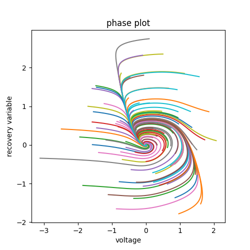
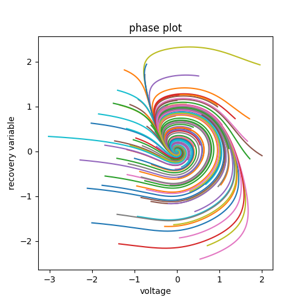
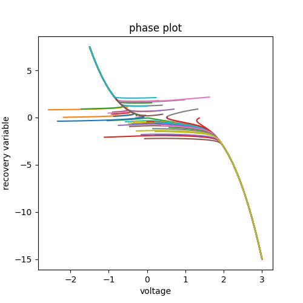

## Experiment 1
- The phase plots were plotted for values of b ranging from 0 to 1 and I\_ext ranging from 0 to 3.
- As the values of I\_ext increased for a fixed value of b, the neuron varied from a a fixed point to a limit cycle and then again a fixed point behaviour. 
- As the value of b increased, the value of I\_ext for which a limit cycle bevaviour was observed also increases

##Experiment 2
# Part 1
Phase plane for I\_ext=0 were plotted for the following values of b
- 0
- 0.4
- 0.8
- -0.5

The following is the plot for b = 0.

The following is the plot for b = 0.4.

The following is the plot for b = 0.8.

The following is the plot for b = -0.5.

##EXPERIMENT 3
Phase plot, W vs t and V vs t plots for the following initial states.
- b = 0.8
- b = 0.4
The value of v is varied between -1 and 2 by steps of 0.1 to obtain different plots
